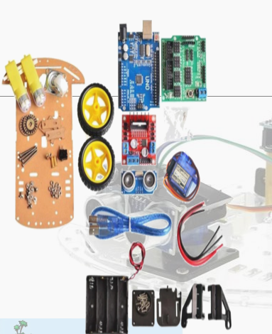

# Robot Inteligente

Materia de Tecnoloxía para Profesorado de ESO

El robot que se presenta a continuación es un robot que lleva en la parte frontal un sensor de
ULTRA SONIDO que es un sensor de proximidad. Cuando el robot o coche se
acerque a un obstáculo, este emite un sonido y al mismo tiempo lo recoge, se mide el
tiempo que tarda volver el sonido emitido, de esta manera detecta los posibles
obstáculos. Para localizar en qué dirección está el obstáculo, el sensor es movido de
tal forma que este describe un medio arco en el frente del coche para poder apuntar a
la derecha, frente e izquierda. Este movimiento es realizado por medio de un motor a
pasos situado en la parte inferior del sensor, controlado por la unidad de control.
Toda esta información recogida por el sensor de ultra sonido, es analizada por
la unidad de control y de ella salen decisiones de cómo se va a mover el coche, es
decir, estas órdenes son enviadas a los motores situados en las ruedas del robot, para
girar ambos al mismo tiempo en la misma dirección, o si es necesario realizar un giro
porque hay un obstáculo, gira uno a la derecha y otro a la izquierda.
Y como se logra esto, pues mediante la programación del robot, es necesario
introducir un código. Este código es leído por la unidad de control, sigue esta lectura y
va comprobando que todo lo que se indica en el código es correcto, si no es correcto,
deriva a otra opción (otra ruta) y continua el camino por esa ruta hasta que llega otros
datos de la lectura realizada por parte del sensor. La unidad de control vuelve a
interpretar esos datos recogidos del sensor, los comprueba con el código que le
hemos introducido y determina que ruta elegir.

La alimentación del robot es a pilas, en este caso 4 pilas de 1.5V.

## Materiales

- Un chasis de coche
- Dos ruedas motrices
- Rueda central
- Dos motores de corriente continua de 48V
- Cuatro soportes laterales del motor
- Caja de baterías para 4 pilas alcalinas AA
- Interruptor ON/OFF
- Una placa Arduino UNO R3
- Una placa SG90
- Una placa FPV
- Módulo controlador L298N
- Tornillería
